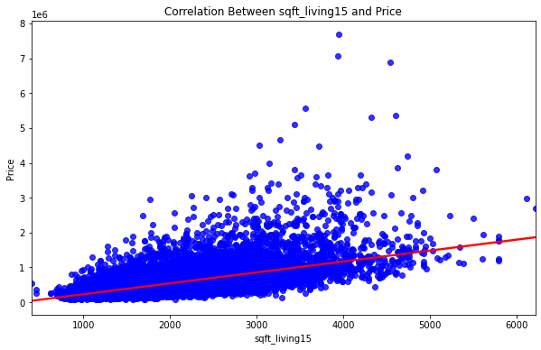
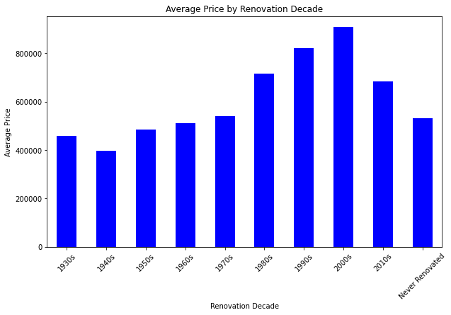

# Real Estate Market Analysis: Predicting Residential Property Prices

<h2>Table of Contents</h2>
<div class="alert alert-block alert-info" style="margin-top: 20px">
    <ul>
    <li><a href="#Instructions">Instructions</a></li>
    <li><a href="#About-the-Dataset">About the Dataset</a></li>
    <li><a href="#Module-1:-Importing-Data-Sets">Module 1: Importing Data </a></li>
    <li><a href="#Module-2:-Data-Wrangling">Module 2: Data Wrangling</a> </li>
    <li><a href="#Module-3:-Exploratory-Data-Analysis">Module 3: Exploratory Data Analysis</a></li>
    <li><a href="#Module-4:-Model-Development">Module 4: Model Development</a></li>
    <li><a href="#Module-5:-Model-Evaluation-and-Refinement">Module 5: Model Evaluation and Refinement</a></li>
</a></li>
</div>


<hr>

## Introduction
As a Data Analyst working for a Real Estate Investment Trust (REIT), I undertook a project to determine the market price of residential properties based on various features such as square footage, number of bedrooms, number of floors, and more.

The objectives of this project were:

1. To analyze property data and identify the factors influencing housing prices.
2. To develop a predictive model for estimating house prices, enabling data-driven investment decisions.
This process involved data exploration, statistical analysis, visualization, and predictive modeling. The results provided valuable insights to support the company’s strategic entry into the residential real estate market.

## About the Dataset

This dataset contains house sale prices for King County, which includes Seattle. It includes homes sold between May 2014 and May 2015. It was taken from [here](https://www.kaggle.com/harlfoxem/housesalesprediction?utm_medium=Exinfluencer&utm_source=Exinfluencer&utm_content=000026UJ&utm_term=10006555&utm_id=NA-SkillsNetwork-wwwcourseraorg-SkillsNetworkCoursesIBMDeveloperSkillsNetworkDA0101ENSkillsNetwork20235326-2022-01-01). It was also slightly modified for the purposes of this course. 


| Variable      | Description                                                                                                 |
| :------------- | :----------------------------------------------------------------------------------------------------------- |
| id            | A notation for a house                                                                                      |
| date          | Date house was sold                                                                                         |
| price         | Price is prediction target                                                                                  |
| bedrooms      | Number of bedrooms                                                                                          |
| bathrooms     | Number of bathrooms                                                                                         |
| sqft_living   | Square footage of the home                                                                                  |
| sqft_lot      | Square footage of the lot                                                                                   |
| floors        | Total floors (levels) in house                                                                              |
| waterfront    | House which has a view to a waterfront                                                                      |
| view          | Has been viewed                                                                                             |
| condition     | How good the condition is overall                                                                           |
| grade         | overall grade given to the housing unit, based on King County grading system                                |
| sqft_above    | Square footage of house apart from basement                                                                 |
| sqft_basement | Square footage of the basement                                                                              |
| yr_built      | Built Year                                                                                                  |
| yr_renovated  | Year when house was renovated                                                                               |
| zipcode       | Zip code                                                                                                    |
| lat           | Latitude coordinate                                                                                         |
| long          | Longitude coordinate                                                                                        |
| sqft_living15 | Living room area in 2015(implies-- some renovations) This might or might not have affected the lotsize area |
| sqft_lot15    | LotSize area in 2015(implies-- some renovations)  


## **Import the required libraries**


```python
!pip install seaborn
```

    


```python
import seaborn as sns
import matplotlib.pyplot as plt
```


```python
import pandas as pd
import matplotlib.pyplot as plt
import numpy as np
import seaborn as sns
from sklearn.pipeline import Pipeline
from sklearn.preprocessing import StandardScaler,PolynomialFeatures
from sklearn.linear_model import LinearRegression
%matplotlib inline
```

## Module 1: Importing Data Sets


```python
filepath = r'D:\tri adi\*\housing.csv'

df = pd.read_csv(filepath)

print(df)
```

           Unnamed: 0          id             date     price  bedrooms  bathrooms  \
    0               0  7129300520  20141013T000000  221900.0       3.0       1.00   
    1               1  6414100192  20141209T000000  538000.0       3.0       2.25   
    2               2  5631500400  20150225T000000  180000.0       2.0       1.00   
    3               3  2487200875  20141209T000000  604000.0       4.0       3.00   
    4               4  1954400510  20150218T000000  510000.0       3.0       2.00   
    ...           ...         ...              ...       ...       ...        ...   
    21608       21608   263000018  20140521T000000  360000.0       3.0       2.50   
    21609       21609  6600060120  20150223T000000  400000.0       4.0       2.50   
    21610       21610  1523300141  20140623T000000  402101.0       2.0       0.75   
    21611       21611   291310100  20150116T000000  400000.0       3.0       2.50   
    21612       21612  1523300157  20141015T000000  325000.0       2.0       0.75   
    
           sqft_living  sqft_lot  floors  waterfront  ...  grade  sqft_above  \
    0             1180      5650     1.0           0  ...      7        1180   
    1             2570      7242     2.0           0  ...      7        2170   
    2              770     10000     1.0           0  ...      6         770   
    3             1960      5000     1.0           0  ...      7        1050   
    4             1680      8080     1.0           0  ...      8        1680   
    ...            ...       ...     ...         ...  ...    ...         ...   
    21608         1530      1131     3.0           0  ...      8        1530   
    21609         2310      5813     2.0           0  ...      8        2310   
    21610         1020      1350     2.0           0  ...      7        1020   
    21611         1600      2388     2.0           0  ...      8        1600   
    21612         1020      1076     2.0           0  ...      7        1020   
    
           sqft_basement  yr_built  yr_renovated  zipcode      lat     long  \
    0                  0      1955             0    98178  47.5112 -122.257   
    1                400      1951          1991    98125  47.7210 -122.319   
    2                  0      1933             0    98028  47.7379 -122.233   
    3                910      1965             0    98136  47.5208 -122.393   
    4                  0      1987             0    98074  47.6168 -122.045   
    ...              ...       ...           ...      ...      ...      ...   
    21608              0      2009             0    98103  47.6993 -122.346   
    21609              0      2014             0    98146  47.5107 -122.362   
    21610              0      2009             0    98144  47.5944 -122.299   
    21611              0      2004             0    98027  47.5345 -122.069   
    21612              0      2008             0    98144  47.5941 -122.299   
    
           sqft_living15  sqft_lot15  
    0               1340        5650  
    1               1690        7639  
    2               2720        8062  
    3               1360        5000  
    4               1800        7503  
    ...              ...         ...  
    21608           1530        1509  
    21609           1830        7200  
    21610           1020        2007  
    21611           1410        1287  
    21612           1020        1357  
    
    [21613 rows x 22 columns]
    


```python
df.head()
```


<div>
<style scoped>
    .dataframe tbody tr th:only-of-type {
        vertical-align: middle;
    }

    .dataframe tbody tr th {
        vertical-align: top;
    }

    .dataframe thead th {
        text-align: right;
    }
</style>
<table border="1" class="dataframe">
  <thead>
    <tr style="text-align: right;">
      <th></th>
      <th>Unnamed: 0</th>
      <th>id</th>
      <th>date</th>
      <th>price</th>
      <th>bedrooms</th>
      <th>bathrooms</th>
      <th>sqft_living</th>
      <th>sqft_lot</th>
      <th>floors</th>
      <th>waterfront</th>
      <th>...</th>
      <th>grade</th>
      <th>sqft_above</th>
      <th>sqft_basement</th>
      <th>yr_built</th>
      <th>yr_renovated</th>
      <th>zipcode</th>
      <th>lat</th>
      <th>long</th>
      <th>sqft_living15</th>
      <th>sqft_lot15</th>
    </tr>
  </thead>
  <tbody>
    <tr>
      <th>0</th>
      <td>0</td>
      <td>7129300520</td>
      <td>20141013T000000</td>
      <td>221900.0</td>
      <td>3.0</td>
      <td>1.00</td>
      <td>1180</td>
      <td>5650</td>
      <td>1.0</td>
      <td>0</td>
      <td>...</td>
      <td>7</td>
      <td>1180</td>
      <td>0</td>
      <td>1955</td>
      <td>0</td>
      <td>98178</td>
      <td>47.5112</td>
      <td>-122.257</td>
      <td>1340</td>
      <td>5650</td>
    </tr>
    <tr>
      <th>1</th>
      <td>1</td>
      <td>6414100192</td>
      <td>20141209T000000</td>
      <td>538000.0</td>
      <td>3.0</td>
      <td>2.25</td>
      <td>2570</td>
      <td>7242</td>
      <td>2.0</td>
      <td>0</td>
      <td>...</td>
      <td>7</td>
      <td>2170</td>
      <td>400</td>
      <td>1951</td>
      <td>1991</td>
      <td>98125</td>
      <td>47.7210</td>
      <td>-122.319</td>
      <td>1690</td>
      <td>7639</td>
    </tr>
    <tr>
      <th>2</th>
      <td>2</td>
      <td>5631500400</td>
      <td>20150225T000000</td>
      <td>180000.0</td>
      <td>2.0</td>
      <td>1.00</td>
      <td>770</td>
      <td>10000</td>
      <td>1.0</td>
      <td>0</td>
      <td>...</td>
      <td>6</td>
      <td>770</td>
      <td>0</td>
      <td>1933</td>
      <td>0</td>
      <td>98028</td>
      <td>47.7379</td>
      <td>-122.233</td>
      <td>2720</td>
      <td>8062</td>
    </tr>
    <tr>
      <th>3</th>
      <td>3</td>
      <td>2487200875</td>
      <td>20141209T000000</td>
      <td>604000.0</td>
      <td>4.0</td>
      <td>3.00</td>
      <td>1960</td>
      <td>5000</td>
      <td>1.0</td>
      <td>0</td>
      <td>...</td>
      <td>7</td>
      <td>1050</td>
      <td>910</td>
      <td>1965</td>
      <td>0</td>
      <td>98136</td>
      <td>47.5208</td>
      <td>-122.393</td>
      <td>1360</td>
      <td>5000</td>
    </tr>
    <tr>
      <th>4</th>
      <td>4</td>
      <td>1954400510</td>
      <td>20150218T000000</td>
      <td>510000.0</td>
      <td>3.0</td>
      <td>2.00</td>
      <td>1680</td>
      <td>8080</td>
      <td>1.0</td>
      <td>0</td>
      <td>...</td>
      <td>8</td>
      <td>1680</td>
      <td>0</td>
      <td>1987</td>
      <td>0</td>
      <td>98074</td>
      <td>47.6168</td>
      <td>-122.045</td>
      <td>1800</td>
      <td>7503</td>
    </tr>
  </tbody>
</table>
<p>5 rows × 22 columns</p>
</div>


```python
df.dtypes
```


    Unnamed: 0         int64
    id                 int64
    date              object
    price            float64
    bedrooms         float64
    bathrooms        float64
    sqft_living        int64
    sqft_lot           int64
    floors           float64
    waterfront         int64
    view               int64
    condition          int64
    grade              int64
    sqft_above         int64
    sqft_basement      int64
    yr_built           int64
    yr_renovated       int64
    zipcode            int64
    lat              float64
    long             float64
    sqft_living15      int64
    sqft_lot15         int64
    dtype: object


## Module 2: Data Wrangling

Cleaning the Dataset

The goal of data wrangling is to ensure the data is clean, relevant, and ready for analysis or modeling.

Removing columns like id and Unnamed: 0 is part of this process.


```python
df = pd.read_csv(filepath)
df.drop(["id", "Unnamed: 0"], axis=1, inplace=True)
print()
summary = df.describe()
print(summary)
```

    
                  price      bedrooms     bathrooms   sqft_living      sqft_lot  \
    count  2.161300e+04  21600.000000  21603.000000  21613.000000  2.161300e+04   
    mean   5.400881e+05      3.372870      2.115736   2079.899736  1.510697e+04   
    std    3.671272e+05      0.926657      0.768996    918.440897  4.142051e+04   
    min    7.500000e+04      1.000000      0.500000    290.000000  5.200000e+02   
    25%    3.219500e+05      3.000000      1.750000   1427.000000  5.040000e+03   
    50%    4.500000e+05      3.000000      2.250000   1910.000000  7.618000e+03   
    75%    6.450000e+05      4.000000      2.500000   2550.000000  1.068800e+04   
    max    7.700000e+06     33.000000      8.000000  13540.000000  1.651359e+06   
    
                 floors    waterfront          view     condition         grade  \
    count  21613.000000  21613.000000  21613.000000  21613.000000  21613.000000   
    mean       1.494309      0.007542      0.234303      3.409430      7.656873   
    std        0.539989      0.086517      0.766318      0.650743      1.175459   
    min        1.000000      0.000000      0.000000      1.000000      1.000000   
    25%        1.000000      0.000000      0.000000      3.000000      7.000000   
    50%        1.500000      0.000000      0.000000      3.000000      7.000000   
    75%        2.000000      0.000000      0.000000      4.000000      8.000000   
    max        3.500000      1.000000      4.000000      5.000000     13.000000   
    
             sqft_above  sqft_basement      yr_built  yr_renovated       zipcode  \
    count  21613.000000   21613.000000  21613.000000  21613.000000  21613.000000   
    mean    1788.390691     291.509045   1971.005136     84.402258  98077.939805   
    std      828.090978     442.575043     29.373411    401.679240     53.505026   
    min      290.000000       0.000000   1900.000000      0.000000  98001.000000   
    25%     1190.000000       0.000000   1951.000000      0.000000  98033.000000   
    50%     1560.000000       0.000000   1975.000000      0.000000  98065.000000   
    75%     2210.000000     560.000000   1997.000000      0.000000  98118.000000   
    max     9410.000000    4820.000000   2015.000000   2015.000000  98199.000000   
    
                    lat          long  sqft_living15     sqft_lot15  
    count  21613.000000  21613.000000   21613.000000   21613.000000  
    mean      47.560053   -122.213896    1986.552492   12768.455652  
    std        0.138564      0.140828     685.391304   27304.179631  
    min       47.155900   -122.519000     399.000000     651.000000  
    25%       47.471000   -122.328000    1490.000000    5100.000000  
    50%       47.571800   -122.230000    1840.000000    7620.000000  
    75%       47.678000   -122.125000    2360.000000   10083.000000  
    max       47.777600   -121.315000    6210.000000  871200.000000  
    


```python
null_counts = df.isnull().sum()
print(null_counts[null_counts > 0])
```

    bedrooms     13
    bathrooms    10
    dtype: int64
    

df.isnull()

Returns a DataFrame with True for elements that are NaN and False for elements that are not NaN.

.sum()

Sums up the True values (which are counted as 1) along each column, resulting in the total number of NaN values for every column.

null_counts[null_counts > 0]

Filters out only the columns that have null (NaN) values (i.e., where the count of NaN is greater than 0).


```python
print("number of NaN values for the column bedrooms :", df['bedrooms'].isnull().sum())
print("number of NaN values for the column bathrooms :", df['bathrooms'].isnull().sum())
```

    number of NaN values for the column bedrooms : 13
    number of NaN values for the column bathrooms : 10
    

Handling missing data (NaN) in the bedrooms and bathrooms columns by replacing those values with the mean of each respective column. Ensuring that all missing values in these columns have been resolved by checking the remaining number of NaN values.


```python
mean=df['bedrooms'].mean()
df['bedrooms'].replace(np.nan,mean, inplace=True)
```


```python
mean=df['bathrooms'].mean()
df['bathrooms'].replace(np.nan,mean, inplace=True)
```


```python
print("number of NaN values for the column bedrooms :", df['bedrooms'].isnull().sum())
print("number of NaN values for the column bathrooms :", df['bathrooms'].isnull().sum())
```

    number of NaN values for the column bedrooms : 0
    number of NaN values for the column bathrooms : 0
    

# Module 3: Exploratory Data Analysis


What are the main characteristics that have the most impact on the house price?


```python
df.describe()
```


<div>
<style scoped>
    .dataframe tbody tr th:only-of-type {
        vertical-align: middle;
    }

    .dataframe tbody tr th {
        vertical-align: top;
    }

    .dataframe thead th {
        text-align: right;
    }
</style>
<table border="1" class="dataframe">
  <thead>
    <tr style="text-align: right;">
      <th></th>
      <th>price</th>
      <th>bedrooms</th>
      <th>bathrooms</th>
      <th>sqft_living</th>
      <th>sqft_lot</th>
      <th>floors</th>
      <th>waterfront</th>
      <th>view</th>
      <th>condition</th>
      <th>grade</th>
      <th>sqft_above</th>
      <th>sqft_basement</th>
      <th>yr_built</th>
      <th>yr_renovated</th>
      <th>zipcode</th>
      <th>lat</th>
      <th>long</th>
      <th>sqft_living15</th>
      <th>sqft_lot15</th>
    </tr>
  </thead>
  <tbody>
    <tr>
      <th>count</th>
      <td>2.161300e+04</td>
      <td>21600.000000</td>
      <td>21603.000000</td>
      <td>21613.000000</td>
      <td>2.161300e+04</td>
      <td>21613.000000</td>
      <td>21613.000000</td>
      <td>21613.000000</td>
      <td>21613.000000</td>
      <td>21613.000000</td>
      <td>21613.000000</td>
      <td>21613.000000</td>
      <td>21613.000000</td>
      <td>21613.000000</td>
      <td>21613.000000</td>
      <td>21613.000000</td>
      <td>21613.000000</td>
      <td>21613.000000</td>
      <td>21613.000000</td>
    </tr>
    <tr>
      <th>mean</th>
      <td>5.400881e+05</td>
      <td>3.372870</td>
      <td>2.115736</td>
      <td>2079.899736</td>
      <td>1.510697e+04</td>
      <td>1.494309</td>
      <td>0.007542</td>
      <td>0.234303</td>
      <td>3.409430</td>
      <td>7.656873</td>
      <td>1788.390691</td>
      <td>291.509045</td>
      <td>1971.005136</td>
      <td>84.402258</td>
      <td>98077.939805</td>
      <td>47.560053</td>
      <td>-122.213896</td>
      <td>1986.552492</td>
      <td>12768.455652</td>
    </tr>
    <tr>
      <th>std</th>
      <td>3.671272e+05</td>
      <td>0.926657</td>
      <td>0.768996</td>
      <td>918.440897</td>
      <td>4.142051e+04</td>
      <td>0.539989</td>
      <td>0.086517</td>
      <td>0.766318</td>
      <td>0.650743</td>
      <td>1.175459</td>
      <td>828.090978</td>
      <td>442.575043</td>
      <td>29.373411</td>
      <td>401.679240</td>
      <td>53.505026</td>
      <td>0.138564</td>
      <td>0.140828</td>
      <td>685.391304</td>
      <td>27304.179631</td>
    </tr>
    <tr>
      <th>min</th>
      <td>7.500000e+04</td>
      <td>1.000000</td>
      <td>0.500000</td>
      <td>290.000000</td>
      <td>5.200000e+02</td>
      <td>1.000000</td>
      <td>0.000000</td>
      <td>0.000000</td>
      <td>1.000000</td>
      <td>1.000000</td>
      <td>290.000000</td>
      <td>0.000000</td>
      <td>1900.000000</td>
      <td>0.000000</td>
      <td>98001.000000</td>
      <td>47.155900</td>
      <td>-122.519000</td>
      <td>399.000000</td>
      <td>651.000000</td>
    </tr>
    <tr>
      <th>25%</th>
      <td>3.219500e+05</td>
      <td>3.000000</td>
      <td>1.750000</td>
      <td>1427.000000</td>
      <td>5.040000e+03</td>
      <td>1.000000</td>
      <td>0.000000</td>
      <td>0.000000</td>
      <td>3.000000</td>
      <td>7.000000</td>
      <td>1190.000000</td>
      <td>0.000000</td>
      <td>1951.000000</td>
      <td>0.000000</td>
      <td>98033.000000</td>
      <td>47.471000</td>
      <td>-122.328000</td>
      <td>1490.000000</td>
      <td>5100.000000</td>
    </tr>
    <tr>
      <th>50%</th>
      <td>4.500000e+05</td>
      <td>3.000000</td>
      <td>2.250000</td>
      <td>1910.000000</td>
      <td>7.618000e+03</td>
      <td>1.500000</td>
      <td>0.000000</td>
      <td>0.000000</td>
      <td>3.000000</td>
      <td>7.000000</td>
      <td>1560.000000</td>
      <td>0.000000</td>
      <td>1975.000000</td>
      <td>0.000000</td>
      <td>98065.000000</td>
      <td>47.571800</td>
      <td>-122.230000</td>
      <td>1840.000000</td>
      <td>7620.000000</td>
    </tr>
    <tr>
      <th>75%</th>
      <td>6.450000e+05</td>
      <td>4.000000</td>
      <td>2.500000</td>
      <td>2550.000000</td>
      <td>1.068800e+04</td>
      <td>2.000000</td>
      <td>0.000000</td>
      <td>0.000000</td>
      <td>4.000000</td>
      <td>8.000000</td>
      <td>2210.000000</td>
      <td>560.000000</td>
      <td>1997.000000</td>
      <td>0.000000</td>
      <td>98118.000000</td>
      <td>47.678000</td>
      <td>-122.125000</td>
      <td>2360.000000</td>
      <td>10083.000000</td>
    </tr>
    <tr>
      <th>max</th>
      <td>7.700000e+06</td>
      <td>33.000000</td>
      <td>8.000000</td>
      <td>13540.000000</td>
      <td>1.651359e+06</td>
      <td>3.500000</td>
      <td>1.000000</td>
      <td>4.000000</td>
      <td>5.000000</td>
      <td>13.000000</td>
      <td>9410.000000</td>
      <td>4820.000000</td>
      <td>2015.000000</td>
      <td>2015.000000</td>
      <td>98199.000000</td>
      <td>47.777600</td>
      <td>-121.315000</td>
      <td>6210.000000</td>
      <td>871200.000000</td>
    </tr>
  </tbody>
</table>
</div>


## Feature Identification: Categorical and Numerical

Based on the data provided, here is the identification of categorical and numerical features based on their respective characteristics:

---

### 1. Categorical Features
Categorical features are features that have discrete or label-based values, either in text or numeric form. These values are typically not used in mathematical operations.

#### Categories (Discrete or Label):
- **`floors`**: Number of floors (1.0, 2.0, 3.0, etc.).
- **`waterfront`**: Indicator of whether the house has waterfront access (0 = No, 1 = Yes).
- **`view`**: Indicator of the quality of the view.
- **`condition`**: Indicator of the overall condition of the house.
- **`grade`**: Overall grade of the house based on the King County grading system.
- **`zipcode`**: Postal code; although numeric, it is a category because it has no quantitative meaning.
- **`yr_renovated`**: Year of renovation; although numeric, it is often grouped into categories (e.g., "Never Renovated" vs. "Specific Year").

---

### 2. Numerical Features
Numerical features have quantitative values that can be used for mathematical operations like mean, standard deviation, or correlation.

#### Numerical (Continuous/Discrete):
- **`price`**: Price of the house (target variable).
- **`bedrooms`**: Number of bedrooms (discrete but numerical).
- **`bathrooms`**: Number of bathrooms (can be continuous, e.g., 2.5).
- **`sqft_living`**: Living area size in square feet.
- **`sqft_lot`**: Lot size in square feet.
- **`sqft_above`**: Square footage of the house above ground (excluding the basement).
- **`sqft_basement`**: Square footage of the basement.
- **`lat`**: Latitude coordinate (geospatial).
- **`long`**: Longitude coordinate (geospatial).
- **`sqft_living15`**: Living area size based on 2015 data.
- **`sqft_lot15`**: Lot size based on 2015 data.
- **`yr_built`**: Year the house was built (although numeric, it is treated as numerical for analysis).

---

### 3. Irrelevant Features
Some features might not be relevant for direct analysis due to their nature as unique identifiers:

- **`Unnamed: 0`**: Index (not necessary for analysis).
- **`id`**: Unique identifier for the house (not relevant for analysis).
- **`date`**: Date the house was sold (should be converted to a time format if needed for temporal analysis).

---

### Summary Table

| Feature            | Type            | Description                                                                 |
|:-------------------|:----------------|:----------------------------------------------------------------------------|
| `price`            | Numerical       | Target variable (house price).                                              |
| `bedrooms`         | Numerical       | Number of bedrooms.                                                         |
| `bathrooms`        | Numerical       | Number of bathrooms.                                                        |
| `sqft_living`      | Numerical       | Living area size in square feet.                                            |
| `sqft_lot`         | Numerical       | Lot size in square feet.                                                    |
| `floors`           | Categorical     | Number of floors (discrete category).                                       |
| `waterfront`       | Categorical     | Waterfront access (0 = No, 1 = Yes).                                        |
| `view`             | Categorical     | Indicator of view quality.                                                  |
| `condition`        | Categorical     | Indicator of the house's overall condition.                                 |
| `grade`            | Categorical     | Overall grade of the house (based on King County grading system).           |
| `sqft_above`       | Numerical       | Square footage of the house above ground.                                   |
| `sqft_basement`    | Numerical       | Square footage of the basement.                                             |
| `yr_built`         | Numerical       | Year the house was built.                                                   |
| `yr_renovated`     | Categorical/Numerical | Year of renovation (can be grouped into categories, e.g., "Never Renovated"). |
| `zipcode`          | Categorical     | Postal code of the house.                                                   |
| `lat`              | Numerical       | Latitude (geospatial).                                                      |
| `long`             | Numerical       | Longitude (geospatial).                                                     |
| `sqft_living15`    | Numerical       | Living area size based on 2015 data.                                        |
| `sqft_lot15`       | Numerical       | Lot size based on 2015 data.                                                |


## Numerical Variables:

Continuous numerical variables are variables that may contain any value within some range. They can be of type "int64" or "float64". A great way to visualize these variables is by using scatterplots with fitted lines.

In order to start understanding the (linear) relationship between an individual variable and the price, we can use "regplot" which plots the scatterplot plus the fitted regression line for the data. This will be useful later on for visualizing the fit of the simple linear regression model as well.

Let's see several examples of different linear relationships:

### Bedrooms vs Price


```python
plt.figure(figsize=(10, 6))
sns.regplot(x="bedrooms", y="price", data=df, scatter_kws={"color": "blue"}, line_kws={"color": "red"})
plt.title("Correlation Between bedrooms and Price")
plt.xlabel("bedrooms")
plt.ylabel("Price")
plt.show()
```


    

    


```python
corr_bedrooms_price = df[["bedrooms", "price"]].corr().iloc[0, 1]

print(f"Correlation between bedrooms and price: {corr_lat_price}")
```

    Correlation between bedrooms and price: 0.3070034799952178
    

### Bathrooms vs Price


```python
plt.figure(figsize=(10, 6))
sns.regplot(x="bathrooms", y="price", data=df, scatter_kws={"color": "blue"}, line_kws={"color": "red"})
plt.title("Correlation Between bathrooms and Price")
plt.xlabel("bathrooms")
plt.ylabel("Price")
plt.show()
```


    

    


```python
corr_Bathrooms_price = df[["bathrooms", "price"]].corr().iloc[0, 1]

print(f"Correlation between Bathrooms and price: {corr_lat_price}")
```

    Correlation between Bathrooms and price: 0.3070034799952178
    

### sqft_living vs Price


```python
plt.figure(figsize=(10, 6))
sns.regplot(x="sqft_living", y="price", data=df, scatter_kws={"color": "blue"}, line_kws={"color": "red"})
plt.title("Correlation Between sqft_living and Price")
plt.xlabel("sqft_living")
plt.ylabel("Price")
plt.show()
```


    

    


```python
corr_sqft_living_price = df[["sqft_living", "price"]].corr().iloc[0, 1]

print(f"Correlation between sqft_living and price: {corr_lat_price}")
```

    Correlation between sqft_living and price: 0.3070034799952178
    

### sqft_lot vs Price


```python
plt.figure(figsize=(10, 6))
sns.regplot(x="sqft_lot", y="price", data=df, scatter_kws={"color": "blue"}, line_kws={"color": "red"})
plt.title("Correlation Between sqft_lot and Price")
plt.xlabel("sqft_lot")
plt.ylabel("Price")
plt.show()
```


    

    


```python
corr_sqft_lot_price = df[["sqft_lot", "price"]].corr().iloc[0, 1]

print(f"Correlation between sqft_lot and price: {corr_lat_price}")
```

    Correlation between sqft_lot and price: 0.3070034799952178
    

### sqft_above vs Price


```python
plt.figure(figsize=(10, 6))
sns.regplot(x="sqft_above", y="price", data=df, scatter_kws={"color": "blue"}, line_kws={"color": "red"})
plt.title("Correlation Between sqft_above and Price")
plt.xlabel("sqft_above")
plt.ylabel("Price")
plt.show()
```


    

    


```python
corr_sqft_above_price = df[["sqft_above", "price"]].corr().iloc[0, 1]

print(f"Correlation between sqft_above and price: {corr_lat_price}")
```

    Correlation between sqft_above and price: 0.3070034799952178
    

### sqft_basement vs Price


```python
plt.figure(figsize=(10, 6))
sns.regplot(x="sqft_basement", y="price", data=df, scatter_kws={"color": "blue"}, line_kws={"color": "red"})
plt.title("Correlation Between sqft_basement and Price")
plt.xlabel("sqft_basement")
plt.ylabel("Price")
plt.show()
```


    

    


```python
df[["sqft_basement", "price"]].corr()
```


<div>
<style scoped>
    .dataframe tbody tr th:only-of-type {
        vertical-align: middle;
    }

    .dataframe tbody tr th {
        vertical-align: top;
    }

    .dataframe thead th {
        text-align: right;
    }
</style>
<table border="1" class="dataframe">
  <thead>
    <tr style="text-align: right;">
      <th></th>
      <th>sqft_basement</th>
      <th>price</th>
    </tr>
  </thead>
  <tbody>
    <tr>
      <th>sqft_basement</th>
      <td>1.000000</td>
      <td>0.323816</td>
    </tr>
    <tr>
      <th>price</th>
      <td>0.323816</td>
      <td>1.000000</td>
    </tr>
  </tbody>
</table>
</div>


### lat & long vs Price 


```python
plt.figure(figsize=(10, 6))
sns.regplot(x="lat", y="price", data=df, scatter_kws={"color": "blue"}, line_kws={"color": "red"})
plt.title("Correlation Between Latitude and Price")
plt.xlabel("Latitude")
plt.ylabel("Price")
plt.show()

# Relationship between Longitude and Price
plt.figure(figsize=(10, 6))
sns.regplot(x="long", y="price", data=df, scatter_kws={"color": "green"}, line_kws={"color": "orange"})
plt.title("Correlation Between Longitude and Price")
plt.xlabel("Longitude")
plt.ylabel("Price")
plt.show()
```


    

    


    

    


```python
corr_lat_price = df[["lat", "price"]].corr().iloc[0, 1]
corr_long_price = df[["long", "price"]].corr().iloc[0, 1]

print(f"Correlation between lat and price: {corr_lat_price}")
print(f"Correlation between long and price: {corr_long_price}")
```

    Correlation between lat and price: 0.3070034799952178
    Correlation between long and price: 0.021626241039307104
    

### sqft_living15 vs Price


```python
plt.figure(figsize=(10, 6))
sns.regplot(x="sqft_living15", y="price", data=df, scatter_kws={"color": "blue"}, line_kws={"color": "red"})
plt.title("Correlation Between sqft_living15 and Price")
plt.xlabel("sqft_living15")
plt.ylabel("Price")
plt.show()
```


    

    


```python
corr_long_price = df[["sqft_living15", "price"]].corr().iloc[0, 1]

print(f"Correlation between sqft_living15 and price: {corr_lat_price}")
```

    Correlation between sqft_living15 and price: 0.3070034799952178
    

### sqft_lot15 vs Price


```python
plt.figure(figsize=(10, 6))
sns.regplot(x="sqft_lot15", y="price", data=df, scatter_kws={"color": "blue"}, line_kws={"color": "red"})
plt.title("Correlation Between sqft_lot15 and Price")
plt.xlabel("sqft_lot15")
plt.ylabel("Price")
plt.show()
```


    

    


```python
corr_long_price = df[["sqft_lot15", "price"]].corr().iloc[0, 1]

print(f"Correlation between sqft_lot15 and price: {corr_lat_price}")
```

    Correlation between sqft_lot15 and price: 0.3070034799952178
    

### yr_built vs Price


```python
plt.figure(figsize=(10, 6))
sns.regplot(x="yr_built", y="price", data=df, scatter_kws={"color": "blue"}, line_kws={"color": "red"})
plt.title("Correlation Between yr_built and Price")
plt.xlabel("yr_built")
plt.ylabel("Price")
plt.show()
```


    

    


```python
corr_long_price = df[["yr_built", "price"]].corr().iloc[0, 1]

print(f"Correlation between yr_built and price: {corr_lat_price}")
```

    Correlation between yr_built and price: 0.3070034799952178
    

## Categorical Variables

These are variables that describe a 'characteristic' of a data unit, and are selected from a small group of categories. The categorical variables can have the type "object" or "int64". A good way to visualize categorical variables is by using boxplots.

## floors


```python
floor_counts = df["floors"].value_counts().to_frame()

floor_counts.columns = ["count"]

print(floor_counts)
```

         count
    1.0  10680
    2.0   8241
    1.5   1910
    3.0    613
    2.5    161
    3.5      8
    


```python
floor_counts.plot(kind="bar", legend=False)
plt.title("Distribution of Floors in Houses")
plt.xlabel("Number of Floors")
plt.ylabel("Count")
plt.show()
```


    

    


```python
avg_price_per_floor = df.groupby("floors")["price"].mean().to_frame()
avg_price_per_floor.columns = ["avg_price"]
print(avg_price_per_floor)

# Visualize
avg_price_per_floor.plot(kind="bar", legend=False)
plt.title("Average Price by Number of Floors")
plt.xlabel("Number of Floors")
plt.ylabel("Average Price")
plt.show()
```

               avg_price
    floors              
    1.0     4.421806e+05
    1.5     5.589806e+05
    2.0     6.488912e+05
    2.5     1.060346e+06
    3.0     5.825260e+05
    3.5     9.333125e+05
    


    

    


```python
corr = df["floors"].corr(df["price"])
print(f"Correlation between floors and price: {corr}")
```

    Correlation between floors and price: 0.25679388755071847
    

### waterfront


```python
waterfront_counts = df["waterfront"].value_counts().to_frame()

waterfront_counts.columns = ["count"]

# Print the result
print(waterfront_counts)
```

       count
    0  21450
    1    163
    


```python
waterfront_counts = df["waterfront"].value_counts()

waterfront_counts.plot(kind="pie", autopct='%1.1f%%', startangle=90, colors=["blue", "lightgreen"])
plt.title("Distribution of Houses by Waterfront Access")
plt.ylabel("")  
plt.show()

```


    

    


```python
plt.figure(figsize=(10, 6))
sns.boxplot(x='waterfront', y='price', data=df)  # Ensure 'sns' is correctly imported
plt.title('House Prices by Waterfront View')
plt.xlabel('Waterfront (1 = Yes, 0 = No)')
plt.ylabel('Price')
plt.show()
```


    

    


```python
corr_waterfront_price = df["waterfront"].corr(df["price"])
print(f"Correlation between waterfront and price: {corr_waterfront_price}")
```

    Correlation between waterfront and price: 0.26636943403060215
    

### View: Quality of the View


```python
view_counts = df["view"].value_counts().to_frame()
view_counts.columns = ["count"]
print(view_counts)
```

       count
    0  19489
    2    963
    3    510
    1    332
    4    319
    


```python
avg_price_view = df.groupby("view")["price"].mean().to_frame()
avg_price_view.columns = ["avg_price"]
print(avg_price_view)

avg_price_view.plot(kind="bar", legend=False, color=["blue", "green"])
plt.title("Average Price by view quality")
plt.xlabel("view")
plt.ylabel("Average Price")
plt.xticks(rotation=0)
plt.show()
```

             avg_price
    view              
    0     4.965642e+05
    1     8.122808e+05
    2     7.924009e+05
    3     9.719653e+05
    4     1.463711e+06
    


    

    


```python
avg_price_per_view = df.groupby("view")["price"].mean().to_frame()
avg_price_per_view.columns = ["avg_price"]

view_counts = df["view"].value_counts().to_frame()
view_counts.columns = ["count"]

avg_price_per_view["count"] = view_counts["count"]
```


```python
fig, ax1 = plt.subplots(figsize=(10, 6))

color = "blue"
ax1.bar(avg_price_per_view.index, avg_price_per_view["count"], color=color, alpha=0.7)
ax1.set_ylabel("Count", color=color)
ax1.set_title("Count and Average Price by View")
ax1.set_xlabel("Quality of View")
ax1.tick_params(axis="y", labelcolor=color)

ax2 = ax1.twinx()
color = "red"
ax2.plot(avg_price_per_view.index, avg_price_per_view["avg_price"], color=color, marker="o")
ax2.set_ylabel("Average Price", color=color)
ax2.tick_params(axis="y", labelcolor=color)

plt.show()
```


    

    


```python
plt.figure(figsize=(10, 6))
sns.boxplot(x='view', y='price', data=df)  
plt.title('House Prices by View')
plt.xlabel('view')
plt.ylabel('Price')
plt.show()
```


    

    


```python
corr = df["view"].corr(df["price"])
print(f"Correlation between view and price: {corr}")
```

    Correlation between view and price: 0.39729348829450456
    

### Condition: Overall Condition


```python
condition_counts = df["condition"].value_counts().to_frame()
condition_counts.columns = ["count"]
print(view_counts)
```

       count
    0  19489
    2    963
    3    510
    1    332
    4    319
    


```python
avg_price_condition = df.groupby("condition")["price"].mean().to_frame()
avg_price_condition.columns = ["avg_price"]
print(avg_price_condition)

avg_price_view.plot(kind="bar", legend=False, color=["blue", "green"])
plt.title("Average Price by condition")
plt.xlabel("condition")
plt.ylabel("Average Price")
plt.xticks(rotation=0)
plt.show()
```

                   avg_price
    condition               
    1          334431.666667
    2          327287.145349
    3          542012.578148
    4          521200.390033
    5          612418.089359
    


    

    


```python
avg_price_per_condition = df.groupby("condition")["price"].mean().to_frame()
avg_price_per_condition.columns = ["avg_price"]

condition_counts = df["condition"].value_counts().to_frame()
condition_counts.columns = ["count"]

avg_price_per_condition["count"] = condition_counts["count"]
print(avg_price_per_condition)
```

                   avg_price  count
    condition                      
    1          334431.666667     30
    2          327287.145349    172
    3          542012.578148  14031
    4          521200.390033   5679
    5          612418.089359   1701
    


```python
fig, ax1 = plt.subplots(figsize=(10, 6))

color = "blue"
ax1.bar(avg_price_per_condition.index, avg_price_per_condition["count"], color=color, alpha=0.7)
ax1.set_ylabel("Count", color=color)
ax1.set_title("Count and Average Price by Condition")
ax1.set_xlabel("Condition")
ax1.tick_params(axis="y", labelcolor=color)

ax2 = ax1.twinx()
color = "red"
ax2.plot(avg_price_per_condition.index, avg_price_per_condition["avg_price"], color=color, marker="o")
ax2.set_ylabel("Average Price", color=color)
ax2.tick_params(axis="y", labelcolor=color)

plt.show()
```


    

    


```python
plt.figure(figsize=(10, 6))
sns.boxplot(x='condition', y='price', data=df)  
plt.title('House Prices by condition')
plt.xlabel('condition')
plt.ylabel('Price')
plt.show()
```


    

    


```python
corr_condition_price = df["condition"].corr(df["price"])
print(f"Correlation between condition and price: {corr_condition_price}")
```

    Correlation between condition and price: 0.0363617891289975
    

### Zipcode


```python
avg_price_per_zipcode = df.groupby("zipcode")["price"].mean().to_frame()
avg_price_per_zipcode.columns = ["avg_price"]

zipcode_counts = df["zipcode"].value_counts().to_frame()
zipcode_counts.columns = ["count"]

avg_price_per_zipcode["count"] = zipcode_counts["count"]
print(avg_price_per_zipcode.head())  
```

                avg_price  count
    zipcode                     
    98001    2.808047e+05    362
    98002    2.342840e+05    199
    98003    2.941113e+05    280
    98004    1.355927e+06    317
    98005    8.101649e+05    168
    


```python
fig, ax1 = plt.subplots(figsize=(12, 8))

color = "blue"
ax1.bar(avg_price_per_zipcode.index, avg_price_per_zipcode["count"], color=color, alpha=0.7)
ax1.set_ylabel("Count", color=color)
ax1.set_title("Count and Average Price by Zipcode")
ax1.set_xlabel("Zipcode")
ax1.tick_params(axis="y", labelcolor=color)
ax1.set_xticklabels(avg_price_per_zipcode.index, rotation=90)  # Rotasi label agar lebih mudah dibaca

ax2 = ax1.twinx()
color = "red"
ax2.plot(avg_price_per_zipcode.index, avg_price_per_zipcode["avg_price"], color=color, marker="o")
ax2.set_ylabel("Average Price", color=color)
ax2.tick_params(axis="y", labelcolor=color)

plt.show()
```

    <ipython-input-112-0cfa171392fa>:11: UserWarning: FixedFormatter should only be used together with FixedLocator
      ax1.set_xticklabels(avg_price_per_zipcode.index, rotation=90)  # Rotasi label agar lebih mudah dibaca
    


    

    


```python
corr_condition_price = df["zipcode"].corr(df["price"])
print(f"Correlation between condition and price: {corr_condition_price}")
```

    Correlation between condition and price: -0.053202854298325664
    

### Yr_Renovated: Year of Renovation


```python
df['renovation_status'] = df['yr_renovated'].apply(lambda x: 'Never Renovated' if x == 0 else 'Renovated')

print(df['renovation_status'].value_counts())
```

    Never Renovated    20699
    Renovated            914
    Name: renovation_status, dtype: int64
    


```python
df['renovation_decade'] = df['yr_renovated'].apply(lambda x: 'Never Renovated' if x == 0 else str((x // 10) * 10) + "s")

renovation_counts = df['renovation_decade'].value_counts()
print(renovation_counts)

```

    Never Renovated    20699
    2000s                272
    2010s                186
    1990s                182
    1980s                152
    1970s                 56
    1960s                 34
    1950s                 22
    1940s                  9
    1930s                  1
    Name: renovation_decade, dtype: int64
    


```python
avg_price_by_renovation_status = df.groupby('renovation_status')['price'].mean()
print(avg_price_by_renovation_status)

avg_price_by_decade = df.groupby('renovation_decade')['price'].mean().sort_index()
print(avg_price_by_decade)
```

    renovation_status
    Never Renovated    530360.818155
    Renovated          760379.029540
    Name: price, dtype: float64
    renovation_decade
    1930s              459950.000000
    1940s              398452.777778
    1950s              485446.818182
    1960s              510027.941176
    1970s              540282.946429
    1980s              715644.822368
    1990s              821503.593407
    2000s              908164.511029
    2010s              684684.779570
    Never Renovated    530360.818155
    Name: price, dtype: float64
    


```python
import matplotlib.pyplot as plt

avg_price_by_decade.plot(kind='bar', figsize=(10, 6), color='blue')
plt.title('Average Price by Renovation Decade')
plt.xlabel('Renovation Decade')
plt.ylabel('Average Price')
plt.xticks(rotation=45)
plt.show()
```


    

    


```python
# Group by yr_renovated and calculate average price per year
avg_price_per_year = df[df['yr_renovated'] > 0].groupby('yr_renovated')['price'].mean()

avg_price_per_year.plot(figsize=(12, 6), marker='o', color='green')
plt.title('Trend of Average Price by Year of Renovation')
plt.xlabel('Year of Renovation')
plt.ylabel('Average Price')
plt.grid()
plt.show()
```


    

    


```python
corr_condition_price = df["yr_renovated"].corr(df["price"])
print(f"Correlation between yr_renovated and price: {corr_condition_price}")
```

    Correlation between yr_renovated and price: 0.12643379344089312
    

## Correlation between all features


```python
corr_matrix = df.corr()

# heatmap
plt.figure(figsize=(12, 8))
sns.heatmap(corr_matrix, annot=True, cmap="coolwarm", fmt=".2f")
plt.title("Correlation Heatmap")
plt.show()

# correlation of all features with the target variable 'price'
print(df.corr()["price"].sort_values(ascending=False))
```


    

    


    price            1.000000
    sqft_living      0.702035
    grade            0.667434
    sqft_above       0.605567
    sqft_living15    0.585379
    bathrooms        0.525885
    view             0.397293
    sqft_basement    0.323816
    bedrooms         0.308890
    lat              0.307003
    waterfront       0.266369
    floors           0.256794
    yr_renovated     0.126434
    sqft_lot         0.089661
    sqft_lot15       0.082447
    yr_built         0.054012
    condition        0.036362
    Unnamed: 0       0.027372
    long             0.021626
    id              -0.016762
    zipcode         -0.053203
    Name: price, dtype: float64
    

## Results  
The output shows the correlation between each feature and `price`, sorted from the lowest to the highest correlation:

#### Negative Correlation  
- **`zipcode (-0.053203)`**: A very weak negative correlation, meaning the zip code has no significant relationship with the price.

#### Weak Positive Correlation  
- **`long (0.021626)`**: Longitude coordinates have a very weak relationship with the price.  
- Features such as `condition`, `yr_built`, `sqft_lot15`, and `sqft_lot` also have very weak correlations with the price.

#### Moderate Positive Correlation  
- **`yr_renovated (0.126434)`**: Renovated houses show a slightly stronger relationship with the price.  
- Features such as `floors`, `waterfront`, and `lat` exhibit a moderate correlation with the price.

#### Strong Positive Correlation  
- **`bedrooms (0.308797)`**: The number of bedrooms has a moderately strong positive relationship with the price.  
- Features such as `sqft_basement`, `view`, and `bathrooms` show even stronger correlations with the price.  
- Features like `sqft_living15`, `sqft_above`, and `grade` have relatively high correlations, indicating that size and quality of the house significantly impact the price.

#### Strongest Correlation  
- **`sqft_living (0.702035)`**: The living area size has a very strong positive correlation with the price.  
- **`price (1.000000)`**: The correlation with itself is 1, as any variable is always perfectly correlated with itself.


# Module 4: Model Development


Fit a linear regression model to predict the <code>'price'</code> using the list of features:


```python
features =["floors", "waterfront","lat" ,"bedrooms" ,"sqft_basement" ,"view" ,"bathrooms","sqft_living15","sqft_above","grade","sqft_living"]     
```


```python
X = df[features]  # Features
Y = df["price"]   # Target variable

# Create and fit the linear regression model
lm = LinearRegression()
lm.fit(X, Y)

# Calculate and print R^2
r2 = lm.score(X, Y)
print(f"R^2: {r2}")
```

    R^2: 0.657679183672129
    

### Results

R^2: 0.657679183672129

The R² value of 0.6577 indicates that approximately 65.77% of the variation in house prices (price) can be explained by the features used in the model.
The remaining 34.23% represents the variation that is not explained by the model, which might be due to other factors not included in the features, noise in the data, or non-linear relationships between the features and the target.


### Create a list of tuples, the first element in the tuple contains the name of the estimator:

<code>'scale'</code>

<code>'polynomial'</code>

<code>'model'</code>

The second element in the tuple  contains the model constructor

<code>StandardScaler()</code>

<code>PolynomialFeatures(include_bias=False)</code>

<code>LinearRegression()</code>


```python
Input=[('scale',StandardScaler()),('polynomial', PolynomialFeatures(include_bias=False)),('model',LinearRegression())]
```


Use the list to create a pipeline object to predict the 'price', fit the object using the features in the list <code>features</code>, and calculate the R^2. 


```python
from sklearn.metrics import r2_score 
features = ["floors", "waterfront", "lat", "bedrooms", "sqft_basement", "view", "bathrooms", "sqft_living15", "sqft_above", "grade", "sqft_living"]
X = df[features]  # Features
Y = df["price"]   # Target variable

# Create a list of tuples for the pipeline
input_pipeline = [
    ('scale', StandardScaler()),  # Step 1: Scale the data
    ('polynomial', PolynomialFeatures(include_bias=False)),  # Step 2: Apply polynomial feature transformation
    ('model', LinearRegression())  # Step 3: Apply linear regression model
]

# Create the pipeline object
pipeline = Pipeline(input_pipeline)

# Fit the pipeline with the data
pipeline.fit(X, Y)

# Make predictions and calculate R^2
y_pred = pipeline.predict(X)
r2 = r2_score(Y, y_pred)

# Print the R^2 value
print(f"R^2: {r2}")

print(pipeline)

```

    R^2: 0.7513408553851407
    Pipeline(steps=[('scale', StandardScaler()),
                    ('polynomial', PolynomialFeatures(include_bias=False)),
                    ('model', LinearRegression())])
    

### Results
The R² value of 0.7513 indicates that approximately 75.13% of the variation in house prices (price) can be explained by the features used in the model after applying polynomial feature transformation and scaling.
The remaining 24.87% represents the variation not explained by the model, likely due to other factors not included in the features, noise in the data, or complex relationships that the model could not capture.

# Module 5: Model Evaluation and Refinement


Import the necessary modules:


```python
from sklearn.model_selection import cross_val_score
from sklearn.model_selection import train_test_split
print("done")
```

    done
    

Split the data into training and testing sets:


```python
features =["floors", "waterfront","lat" ,"bedrooms" ,"sqft_basement" ,"view" ,"bathrooms","sqft_living15","sqft_above","grade","sqft_living"]    
X = df[features]
Y = df['price']

x_train, x_test, y_train, y_test = train_test_split(X, Y, test_size=0.15, random_state=1)


print("number of test samples:", x_test.shape[0])
print("number of training samples:",x_train.shape[0])
```

    number of test samples: 3242
    number of training samples: 18371
    

Create and fit a Ridge regression object using the training data, set the regularization parameter to 0.1, and calculate the R^2 using the test data. Take a screenshot of your code and the value of the R^2. 


```python
from sklearn.linear_model import Ridge
```


```python
features = ["floors", "waterfront", "lat", "bedrooms", "sqft_basement", "view", "bathrooms", "sqft_living15", "sqft_above", "grade", "sqft_living"]
X = df[features]  # Features
Y = df["price"]   # Target variable

# Split the data into training and test sets (80% train, 20% test)
X_train, X_test, Y_train, Y_test = train_test_split(X, Y, test_size=0.2, random_state=42)

# Standardize the features
scaler = StandardScaler()
X_train_scaled = scaler.fit_transform(X_train)
X_test_scaled = scaler.transform(X_test)

# Create the Ridge regression model with alpha = 0.1 (regularization parameter)
ridge_model = Ridge(alpha=0.1)

# Fit the model on the training data
ridge_model.fit(X_train_scaled, Y_train)

# Make predictions on the test data
y_pred = ridge_model.predict(X_test_scaled)

# Calculate the R^2 value using the test data
r2 = r2_score(Y_test, y_pred)

# Print the R^2 value
print(f"R^2: {r2}")
```

    R^2: 0.6614027981833235
    

### Conclusion

The R² value of **0.6614** indicates that approximately **66.14%** of the variation in house prices (`price`) can be explained by the Ridge regression model using the selected features on the test data.  
The remaining **33.86%** of the variation is not explained by the model, likely due to other factors not included in the features, noise in the data, or relationships that the model could not fully capture.  

The use of Ridge regression with regularization (**alpha = 0.1**) helps mitigate overfitting by penalizing large coefficients, leading to a more generalized model for the test data.


Perform a second order polynomial transform on both the training data and testing data. Create and fit a Ridge regression object using the training data, set the regularisation parameter to 0.1, and calculate the R^2 utilising the test data provided. Take a screenshot of your code and the R^2. You will need to submit it for the final project.


```python
features = ["floors", "waterfront", "lat", "bedrooms", "sqft_basement", "view", "bathrooms", "sqft_living15", "sqft_above", "grade", "sqft_living"]
X = df[features]  # Features
Y = df["price"]   # Target variable

# Split the data into training and test sets (80% train, 20% test)
X_train, X_test, Y_train, Y_test = train_test_split(X, Y, test_size=0.2, random_state=42)

# Perform a second order polynomial transformation on both the training and testing data
poly = PolynomialFeatures(degree=2, include_bias=False)
X_train_poly = poly.fit_transform(X_train)
X_test_poly = poly.transform(X_test)

# Standardize the features (important for Ridge regression)
scaler = StandardScaler()
X_train_scaled = scaler.fit_transform(X_train_poly)
X_test_scaled = scaler.transform(X_test_poly)

# Create the Ridge regression model with alpha = 0.1 (regularization parameter)
ridge_model = Ridge(alpha=0.1)

# Fit the model on the training data
ridge_model.fit(X_train_scaled, Y_train)

# Make predictions on the test data
y_pred = ridge_model.predict(X_test_scaled)

# Calculate the R^2 value using the test data
r2 = r2_score(Y_test, y_pred)

# Print the R^2 value
print(f"R^2: {r2}")
```

    R^2: 0.7024082120153323
    

### Conclusion

The R² value of **0.7024** indicates that approximately **70.24%** of the variation in house prices (`price`) can be explained by the Ridge regression model with polynomial features (degree = 2) and regularization (alpha = 0.1).  
The remaining **29.76%** of the variation is not explained by the model, which could be due to factors not included in the features, noise in the data, or complex relationships that the model could not capture.  

By applying polynomial feature transformation, the model can capture non-linear relationships, improving its ability to fit the data compared to a linear model.

